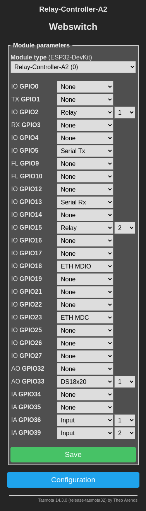

# Webswitch

Cheap Web controlled Relaycontroller via Ethernet and other means (also homeautomation, mqtt, etc)

## Hardware 

### Procurement
[Official Store](https://kincony.aliexpress.com) 
look for KC868-Ax (ESP32 Module)

My HW sample: 
[A2 ESP32 Relay Switch Board Support 4G/2G GPRS Tasmota RS485 I2C Ethernet WiFi](https://www.aliexpress.com/item/1005007465421050.html) With case and (optional)

[SIM7600E](https://www.aliexpress.com/item/1005006806214709.html) With GPS FPC antenna 
(GPS is not supported by KCS firmware)

[Alternate 4 Channel source](https://www.aliexpress.com/item/4001232791244.html) Ethernet Relay Board Network MQTT Home Assistant Domoticz Modbus WiFi RS485 CAN Module HTTP Web TCP UDP CoAP IP Watchdog Timer

## Choose either KCS firmware or Tasmota firmware

### Tasmota

[Webinstaller](https://tasmota.github.io/install/) select "Tasmota (english)"

**Important:**
- Set "Tasmota Other Parameter Template" 
- Choose module type: `Relay-Controller-A2 (0)`
(following example with static Ethernet address):

`{"NAME":"Relay-Controller-A2","GPIO":[1,1,1,1,1,1,1,1,1,1,1,1,1,1,1,1,0,1,1,1,0,1,1,1,0,0,0,0,1,1,1,1,1,0,0,1],"FLAG":0,"BASE":1,"CMND":"EthIPAddress 192.168.42.90 | EthSubnetmask 255.255.255.0 | EthGateway 192.168.42.2 | EthDNSServer1 9.9.9.9 | POWER1 1 | POWER2 1"}`

### KCS V2 KC868-A series firmware:
[Obtain firmware](https://www.kincony.com/forum/showthread.php?tid=3109)
[Flash with eg Tasmota Installer and Chromium Browser](https://tasmota.github.io/install/)
[Configuration Guide](https://www.kincony.com/esp32-kcsv2-firmware.html)
